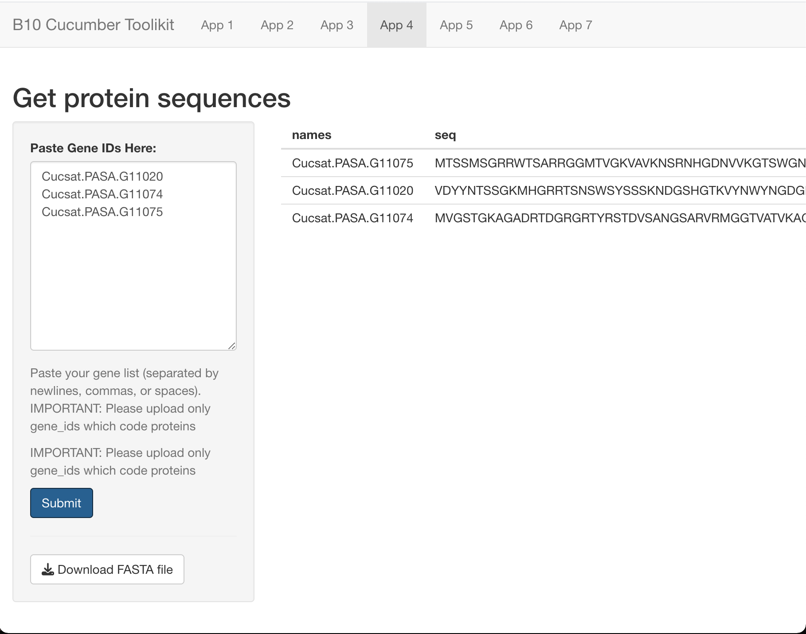

# B10 toolkit
This shiny application combines various applications that enable the analysis of B10 cucumber data. 

## Description
These applications include:
- PlnatRegMap ID converter - converts gene names from the B10 genome to names contained in the PlantRegMap database
- ENTREZ ID converter - converts gene names from the B10 genome to ENTREZ gene numbers
- Create a Heatmap - enables the creation of high-resolution heatmaps with no limit on the size of the input file
- Get protein sequences - enables the retrieval of protein sequences from the B10 cucumber line
- PCA Plot - creation of a PCA plot

## Info
The script was prepared as part of the National Science Center project UMO-2020/37/B/NZ9/00586.

